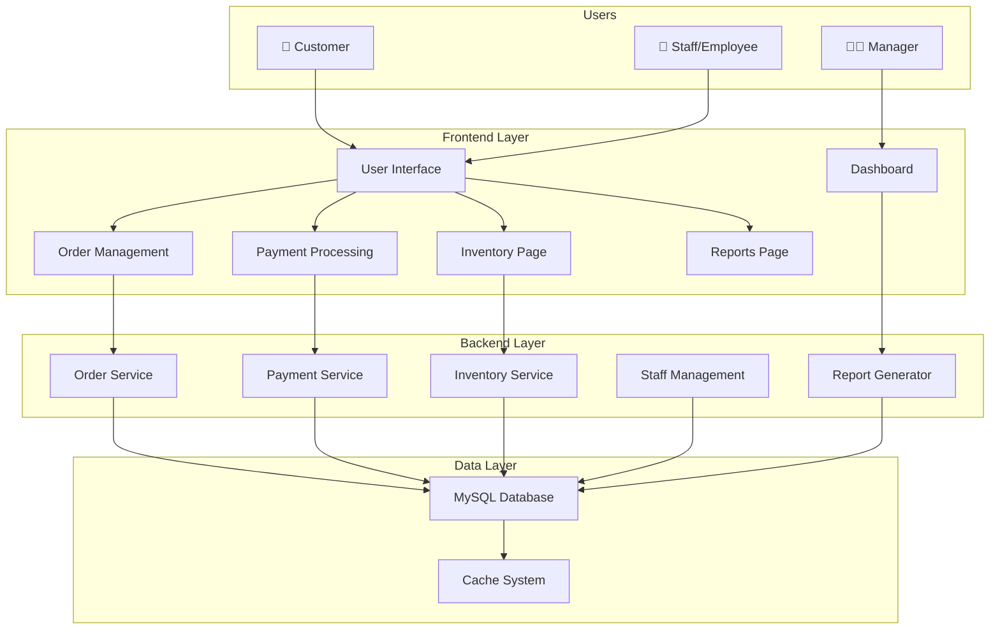
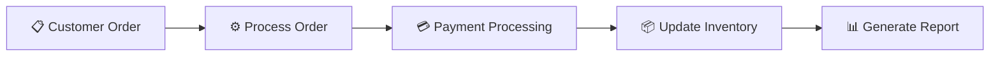
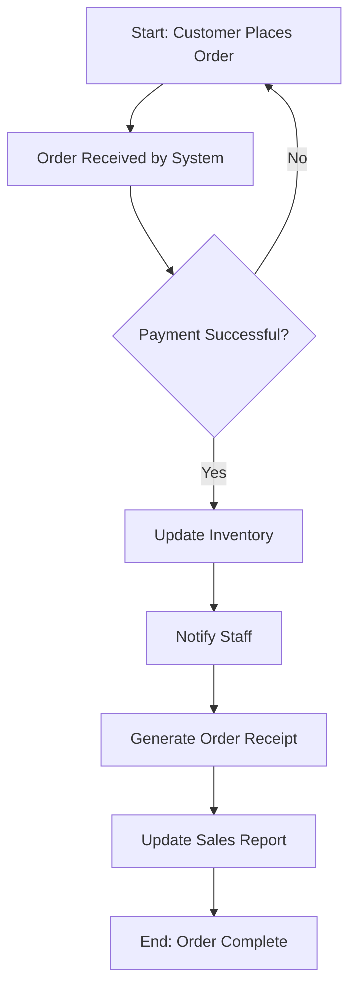
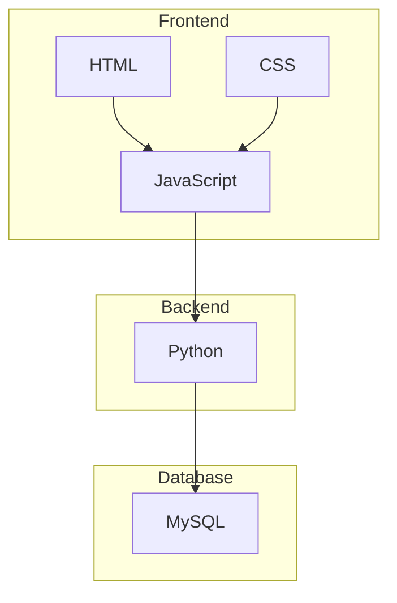
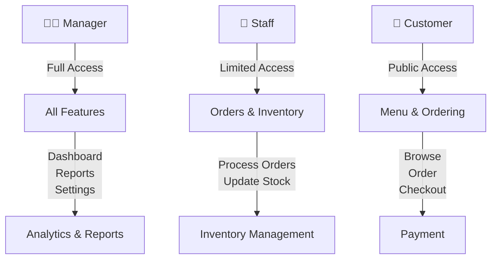

# Smart Coffee Shop Management System - Project Diagram

## System Architecture Diagram



## Data Flow Diagram



## Process Flow Diagram



## Component Relationship Diagram

```mermaid
graph TB
    subgraph "Customer Facing"
        Menu["Menu System"]
        Cart["Shopping Cart"]
    end
    
    subgraph "Transaction"
        Order["Order Processing"]
        Payment["Payment Gateway"]
    end
    
    subgraph "Operations"
        Inventory["Inventory Tracker"]
        Staff["Staff Management"]
    end
    
    subgraph "Analytics"
        Reports["Sales Reports"]
        Analytics["Performance Analytics"]
    end
    
    Menu --> Cart
    Cart --> Order
    Order --> Payment
    Payment --> Inventory
    Inventory --> Staff
    Order --> Reports
    Reports --> Analytics
```

## Technology Stack



## User Roles & Permissions


